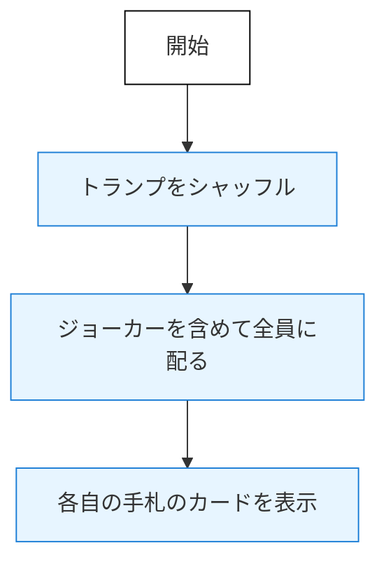
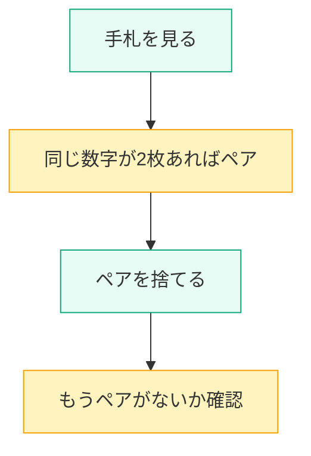
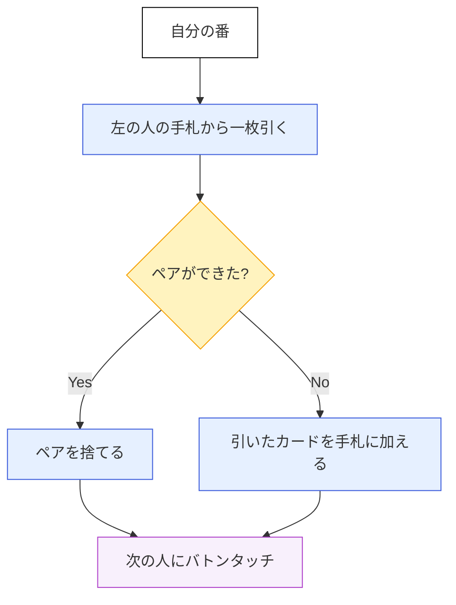
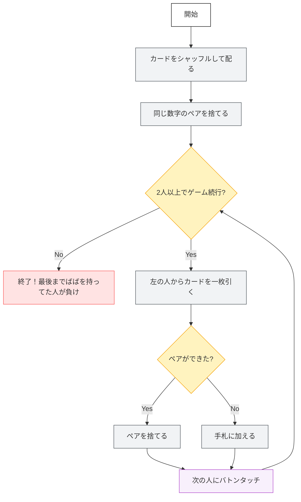

## ◾️ ばば抜きは「アルゴリズム」で考えられるよ

ばば抜きは遊びだけど、ほんとうは「次に何をして、いつ終わるか」が決まっている「あるるれったるルール」=アルゴリズムで動いているんだよ。

たとえば…

* じゃんけんは「グー・チョキ・パー」の結果で勝ち負けが決まる
* サイコロは「出た数字だけ齢を進める」
* ばば抜きは「カードを分配し、ペアを捨て、しまいにばばを持っていた人が負け」

どれも「アルゴリズム」で整理できるんだよ！

---

## ○ じゃあ、ばば抜きのプログラムをちょっとだけまとめてみよう

### （Step 1） カードをらんだむに分配

### （Step 2） 同じ数字のペアを捨てる

### （Step 3） 左の人から一枚引き、ペアがあれば捨てる

---

## ○ これらを組み合わせると…

### （全体のフローチャート）

---

### あらためてまとめ：

> ばば抜きというゲームは
>
> * カードを分配し
> * ペアを捨て
> * 互いにカードを引き合いながら
> * 最後にばばを持っていた人が負けになる
>
> そんな「決まった順番のもとに」くり返しがある、まさに**アルゴリズムのゲーム**だね！
